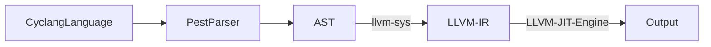

# *cyclang* Language Overview

*cyclang* is a toy programming language that leverages the power of LLVM for efficient code execution. It is designed to transform your code into machine-ready instructions seamlessly. Here's a high level overview of how Cyclang works:

1. **Parsing the Grammar**:  *cyclang* uses the [pest parser](https://pest.rs/), an elegant parser written in Rust, to interpret and process *cyclang* code. You can delve into the intricacies of the cyclang parser in the [source code here](https://github.com/lyledean1/cyclang/blob/main/src/parser.rs) and the [grammar file](https://github.com/lyledean1/cyclang/blob/main/grammar/cyclo.pest).

2. **Translating to LLVM IR**: Once parsed, *cyclang* code gets converted to LLVM Intermediate Representation (IR) through the [llvm-sys crate](https://crates.io/crates/llvm-sys). LLVM IR is a low-level, type-rich representation suitable for efficient machine code generation.

3. **Just-In-Time Compilation**: *cyclang* ensures quick and efficient execution of *cyclang* code by using the LLVM JIT (Just in Time) Execution engine. To see how this happens explore the [Cyclang compiler source code here](https://github.com/lyledean1/cyclang/blob/main/src/compiler/mod.rs).


## Language Features
### Functional

This functional example demonstrates how to write a recursive function in *cyclang* to compute the Fibonacci series.

```rust
fn fib(i32 n) -> i32 {
    if (n < 2) {
        return n;
    }
    return fib(n - 1) + fib(n - 2);
}
print(fib(20));
```

### For Loop

This snippet showcases the standard for loop syntax, iterating from 0 to 9 and printing each value.

```rust
for (let i = 0; i < 10; i++)
{  
    print(i);
}
```

### While Loop

In this example, a while loop continues execution as long as the condition remains true. The loop increments the val variable and exits once val reaches 10.

```rust
let cond = true;
let val = 0;
while (cond) {
    val = val + 1;
    if (val == 10) {
       cond = false;
    }
}
print(val);
```
