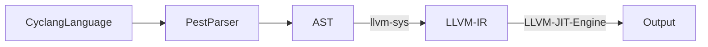

# Overview

Cyclang is a toy language that uses LLVM IR and then compiles down to machine code, the high level architecture is:
- To parse a grammar using the [pest](https://pest.rs/) parser, see the [cyclang parser here](https://github.com/lyledean1/cyclang/blob/main/src/parser.rs)
- To then compile that to LLVM IR with [llvm-sys](https://crates.io/crates/llvm-sys)
- To execute that LLVM IR via the LLVM JIT (Just in Time)  Execution engine, [see the cyclang compiler here](https://github.com/lyledean1/cyclang/blob/main/src/compiler/mod.rs)



## Snippets

### Functional
```rust
fn fib(int n) -> int {
    if (n < 2) {
        return n;
    }
    return fib(n - 1) + fib(n - 2);
}
print(fib(20));
```

### For Loop
```rust
for (let i = 0; i < 10; i++)
{  
    print(i);
}
```
### While Loop
```rust
let cond = true;
let val = 0;
while (cond) {
    val = val + 1;
    if (val == 10) {
       cond = false;
    }
}
print(val);
```
